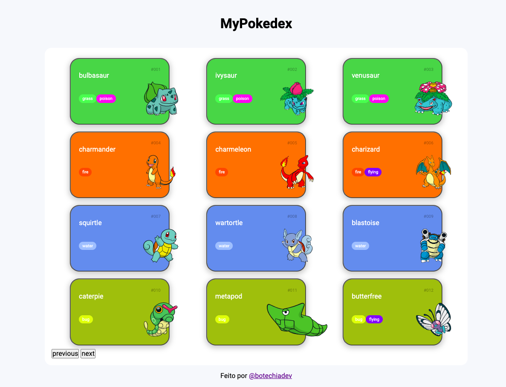

# POKEAPI-FETCH-API
DEPLOY: 

---
Nessa primeira versao da pokeapi-fetch-api vainilla js foi usado unicamente manipulacao do dom e requisicoes por meio de fetch ademas de estillizacao sem framework com puro css e para a semantica o bom e velho html estrutural o resultado deste primeiro deploy foi uma api que consume a pokedexApi famosa API para treinamento de requisicoes de data em formato JSON para aceder o deploy basta clicar no badge acima e abaixo podemos ver uma imagem da API 

